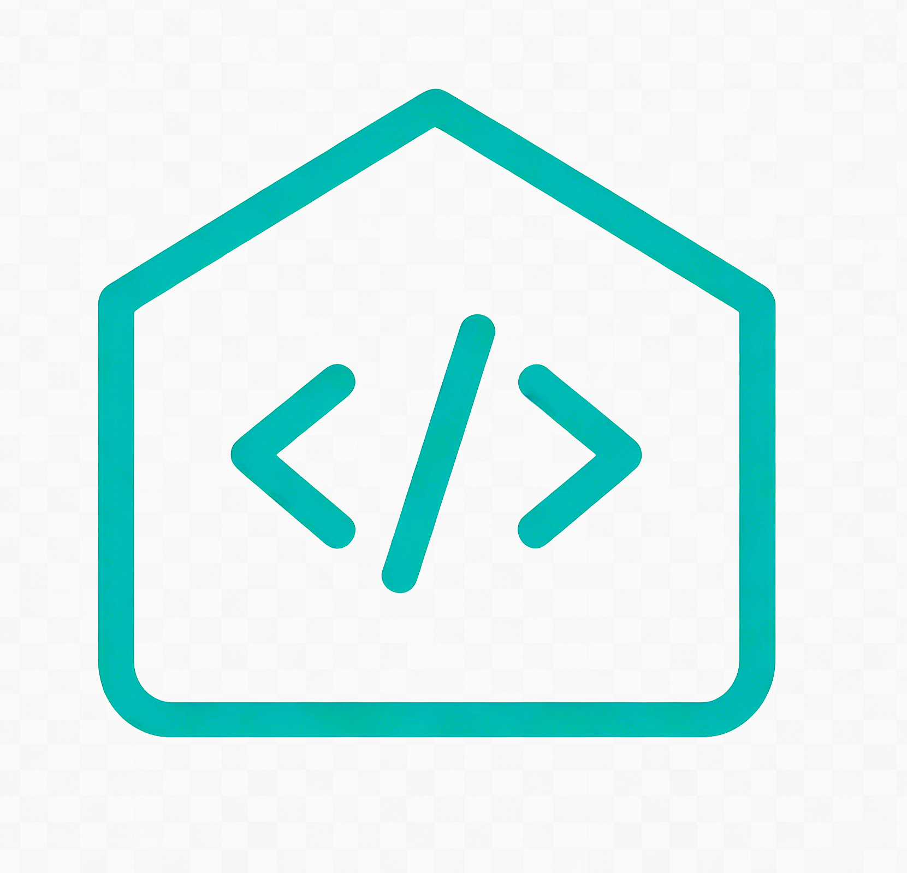
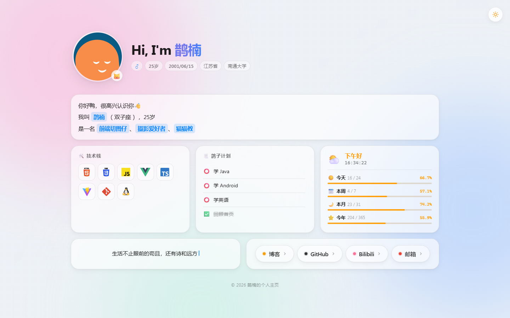
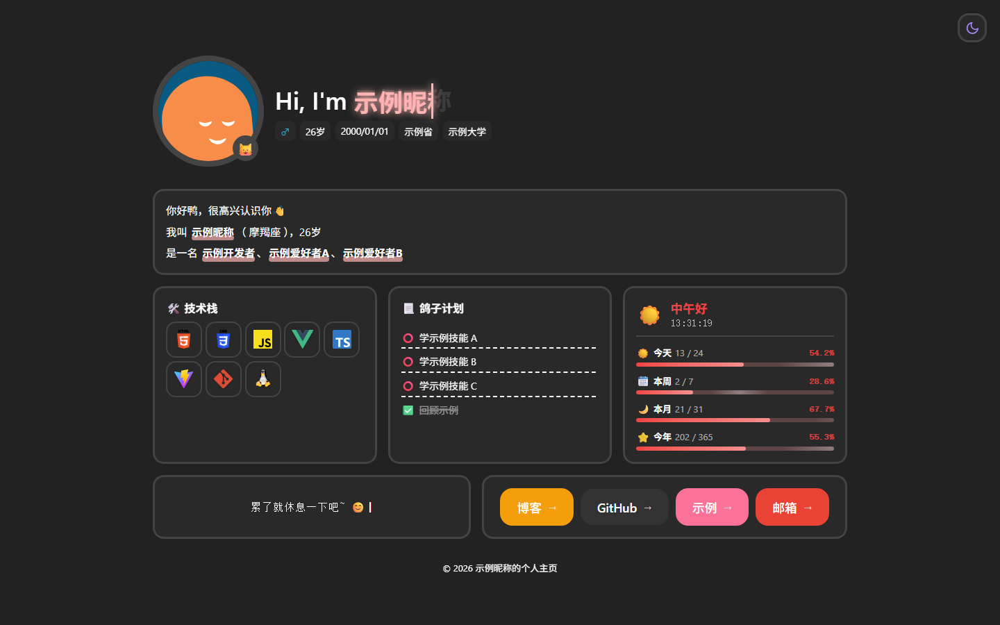
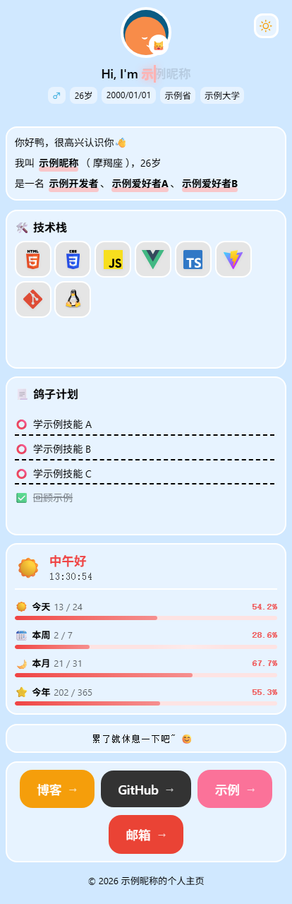
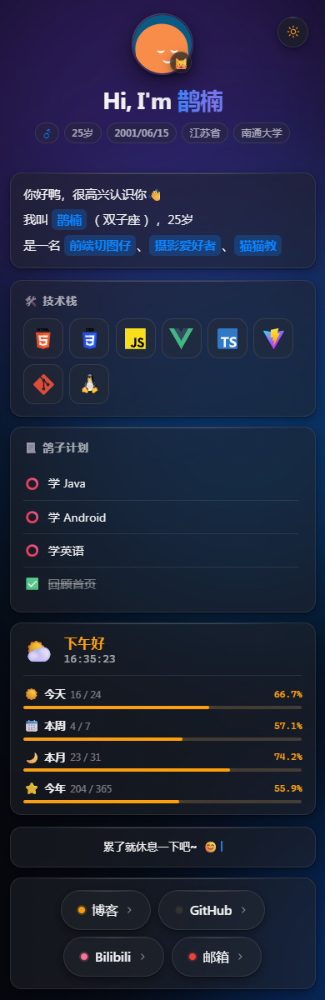

<p align="center">
  
</p>

<h1 align="center">Dageling003-Homepage</h1>

<p align="center">
  <strong>轻量、可自托管的个人主页与可视化管理后台</strong>
  <br />
  告别硬编码 JSON，用表单驱动你的个人主页
</p>

<p align="center">
  <strong>简体中文</strong> · <a href="./README.en.md">English</a>
</p>

<p align="center">
  <a href="https://github.com/Dageling003/Dageling003-Homepage/releases/tag/v1.0.0"></a>
  <a href="https://github.com/Dageling003/Dageling003-Homepage/releases"></a>
  <a href="https://dageling003.top/"></a>
  <a href="https://nodejs.org"></a>
  <a href="https://pnpm.io"></a>
  <a href="./LICENSE"></a>
  <a href="https://nestjs.com"></a>
  <a href="https://vuejs.org"></a>
  <a href="./docker-compose.yml"></a>
</p>

> 🔒 本 README 所有截图均经过隐私脱敏处理：姓名、地区、学校、生日、职业、学习计划、邮箱等已替换为示例占位符。

---

## 🧭 这是什么？

**Homepage** 是一套开箱即用的全栈个人主页系统——包含面向访客的前台展示页、面向站长的可视化管理后台，以及驱动这一切的 RESTful API。

- 🌐 **在线预览**：<https://dageling003.top/> _(徽章会自动探活；若某天服务器/域名到期，徽章会显示 offline，此时请以本仓库截图与本地体验为准)_
- 🎯 **一句话定位**：告别硬编码 JSON，用表单驱动你的个人主页 · 全栈前后端分离 + 可视化后台 + 自动 HTTPS
- 📦 **交付形态**：pnpm monorepo（前台 / 后台 / API 三包）+ Docker Compose 三服务（app / caddy / mariadb）
- 🖼 **无 Demo 也能体验**：所有效果截图已提交到 `image/screenshots/`，clone 仓库即可离线预览；想跑一遍完整交互只需 `pnpm install && pnpm dev`（SQLite 模式，无需数据库）

你不再需要手动编辑 JSON 配置文件。登录管理后台，在表单里填写个人信息、拖拽排序快捷链接、增删技术栈，前台自动生效。审计日志会记录每一次变更，让你随时知道"谁在什么时候改了什么"。

---

## 📸 效果展示

> 截图均从真实部署站点 `https://dageling003.top` 截取，姓名、地区、学校、生日、职业、学习计划、邮箱等隐私信息已替换为示例占位符。
>
> 💡 **关于 Demo 长期可用性**：仓库内截图与线上站点完全解耦，即便未来云服务器 / 域名到期下线，本 README 的效果展示依然有效；届时顶部徽章会自动切换为 `offline`，并请优先参考截图或本地 `pnpm dev` 复现。

<table>
  <tr>
    <td width="50%" align="center">
      <strong>🖥 桌面端 · 亮色主题</strong><br />
      
    </td>
    <td width="50%" align="center">
      <strong>🌙 桌面端 · 暗色主题</strong><br />
      
    </td>
  </tr>
  <tr>
    <td align="center">
      <strong>📱 移动端 · 亮色主题</strong><br />
      
    </td>
    <td align="center">
      <strong>📱 移动端 · 暗色主题</strong><br />
      
    </td>
  </tr>
</table>

### 🎨 UI 设计亮点

整套界面采用 **极简 + 圆角卡片 + 柔和阴影** 的设计语言，所有元素 8px 圆角，整体观感干净治愈。

| 区域 | 特点 | 视觉元素 |
|------|------|----------|
| **顶部 Hero** | 头像 + 姓名 + 多维标签 | 圆角头像胶囊、性别/生日/地区/学校四联标签 |
| **自我介绍** | 一句话人设 | 单卡片，强调"我是谁" |
| **技术栈** | N 枚可拖拽排序 | 彩色技术图标，圆角徽章风格 |
| **鸽子计划** | 待办打卡清单 | 圆圈未完成 / 勾选已完成 / 划线回顾 |
| **时间进度** | 4 条进度条 | 今日 / 本周 / 本月 / 今年，自带 emoji |
| **快捷链接** | 自定义社交卡片 | 大圆角按钮，4 种主题色 |
| **生活寄语** | 心情/座右铭 | 居中显示，光标闪烁动画 |
| **🌗 主题切换** | 右上角一键 | 太阳 ⇄ 月亮图标，CSS 变量驱动 |

**动效与微交互**：⌨️ 打字机欢迎语逐字显示 · 📊 进度条进入视口时平滑增长 · 🎯 主题切换 / 卡片悬停 200ms ease 过渡 · 📐 ≥1024px 三栏、<1024px 单栏响应式 · 🌓 暗色模式采用纯黑背景避免刺眼。

---

## ✨ 为什么选它

<table>
  <tr>
    <td width="50%">
      <strong>🖥 前台展示页</strong><br />
      极简设计，暗色/亮色主题一键切换。打字机动效、时光进度条，让个人主页不再单调。
    </td>
    <td width="50%">
      <strong>⚙️ 可视化后台</strong><br />
      基于 Ant Design Vue 的表单驱动配置页，所见即所得。不需要懂代码就能管理整站内容。
    </td>
  </tr>
  <tr>
    <td>
      <strong>🔐 JWT 鉴权</strong><br />
      bcrypt 12 rounds 哈希 + JWT 无状态会话，路由守卫拦截未登录请求。
    </td>
    <td>
      <strong>📜 审计日志</strong><br />
      每次配置变更自动落库，可按操作人、时间范围、模块筛选追溯。
    </td>
  </tr>
  <tr>
    <td>
      <strong>👤 头像上传</strong><br />
      本地上传 → sharp 自动裁剪压缩为 200×200 WebP，<strong>前端无需关心图片处理</strong>。
    </td>
    <td>
      <strong>🎂 智能填报</strong><br />
      填入出生日期，系统自动计算年龄与星座；34 省选择器 + 1200+ 院校搜索。
    </td>
  </tr>
  <tr>
    <td>
      <strong>🚀 首次设置向导</strong><br />
      新部署自动检测未初始化状态，<strong>8 步向导</strong>（含创建管理员）引导站长完成全站配置。
    </td>
    <td>
      <strong>🐳 一键部署 v3</strong><br />
      <code>bash deploy.sh</code> 向导模式（域名 → 邮箱 → SMTP → 管理员）。自动 HTTPS（<strong>ZeroSSL</strong>，国内可用）。
    </td>
  </tr>
  <tr>
    <td>
      <strong>🔑 找回密码</strong><br />
      登录页「忘记密码」一键发起重置。支持主流邮箱 SMTP（QQ/163/Gmail/Outlook/阿里/腾讯）；<strong>未配 SMTP 时降级写入 docker logs</strong>，SSH 即可拾取链接。
    </td>
    <td>
      <strong>👤 自助创建管理员</strong><br />
      首次部署无需 SSH 改密码，<code>/admin/setup</code> 第一步引导用户<strong>自设账号密码</strong>；已有账号时该步骤自动隐藏。deploy 脚本中也提供 3 选 1（自动生成 / 自定义 / 留空）。
    </td>
  </tr>
  <tr>
    <td>
      <strong>📦 Monorepo</strong><br />
      pnpm workspace 统一管理三端，一条命令启动全部服务。
    </td>
    <td>
      <strong>🛡️ 生产级安全</strong><br />
      helmet 安全头、API 限流、请求体限制、Swagger 生产禁用。
    </td>
  </tr>
</table>

---

## 🏗 架构总览

```
                    ┌──────────────────────────────────┐
                    │        Caddy (80 / 443)           │
                    │    HTTPS · ZeroSSL 证书            │
                    │    自动续签 · 零配置                │
                    │    HEALTHCHECK: caddy validate     │
                    │                                   │
                    │  /         → 静态文件 (公开主页)   │
                    │  /admin*   → 静态文件 (后台)       │
                    │  /api/*    → 反向代理 app:8000    │
                    │  /health   → 健康检查端点          │
                    └────────────────┬──────────────────┘
                                     │
                                     │ /api/* (仅 API)
                                     │
                    ┌────────────────┴──────────────────┐
                    │        Docker Network: frontend     │
                    └────────────────┬──────────────────┘
                                     │
                    ┌────────────────┴──────────────────┐
                    │       NestJS Backend               │
                    │       :8000 (容器内部)              │
                    │    HEALTHCHECK: /health             │
                    │                                   │
                    │  ┌──────────┐  ┌───────────────┐  │
                    │  │ Auth     │  │ MariaDB       │  │
                    │  │ Config   │  │ :3306         │  │
                    │  │ Audit    │  │ (容器内部)     │  │
                    │  └──────────┘  └───────────────┘  │
                    └────────────────┬──────────────────┘
                                     │
                    ┌────────────────┴──────────────────┐
                    │        Docker Network: backend      │
                    └───────────────────────────────────┘
```

| 子项目 | 技术栈 | 开发端口 | 对外路径 |
|--------|--------|----------|----------|
| `apps/frontend` 前台主页 | Vue 3.5 + Vite 8 + UnoCSS + Pinia | `3000` | `/` (Caddy 直接 serve) |
| `apps/admin` 管理后台 | Vue 3.5 + Ant Design Vue 4 + ECharts + Vite 8 | `3001` | `/admin` (Caddy 直接 serve) |
| `apps/backend` API 服务 | NestJS 11 + TypeORM + MariaDB/SQLite + JWT | `8000` | `/api/*` (Caddy 反向代理) |

> **Caddy 直接提供静态文件**：前端/后台的 HTML/JS/CSS 由 Caddy 内置文件服务器直接响应，不经过 Node.js 进程，零额外开销。仅 API 请求到达后端容器。

---

## 🚀 快速开始

### 前置依赖

- **Node.js** ≥ 20.19.0
- **pnpm** ≥ 11.0.0

### 本地开发

#### 方式一：SQLite 日常开发（无需安装数据库）

```bash
# 1. 克隆仓库
git clone https://github.com/Dageling003/Dageling003-Homepage.git
cd homepage

# 2. 安装依赖
pnpm install

# 3. 配置环境变量
cp apps/backend/.env.example apps/backend/.env
# 编辑 .env，设置：
#   DB_TYPE=sqlite —— 使用 SQLite，无需安装数据库
#   务必修改 JWT_SECRET（长度 ≥ 20）和 DEFAULT_ADMIN_PASSWORD（≥ 12 位）

# 4. 一键启动（SQLite 自动建表，无需迁移）
pnpm dev
```

> **💡 三 tab 日常开发流程**
>
> 打开三个终端窗口（或 VS Code 分屏）：
>
> | 窗口 | 命令 | 对应服务 | 说明 |
> |------|------|----------|------|
> | Tab 1 | `pnpm dev:backend` | NestJS API `:8000` | 后端逻辑，热重载 |
> | Tab 2 | `pnpm dev:frontend` | 前台主页 `:3000` | Vite HMR |
> | Tab 3 | `pnpm dev:admin` | 管理后台 `:3001` | Vite HMR |
>
> 三个窗口分别跑，日志互不干扰。某个服务报错只需重启对应窗口，不影响其它两个。
> 前端调后端 API 时，Vite 代理会自动把 `/api/*` 转发到后端服务（默认 `127.0.0.1:8000`）。

#### 方式二：MariaDB 生产部署

- **MariaDB** ≥ 10.5

```bash
# 1. 克隆仓库
git clone https://github.com/Dageling003/Dageling003-Homepage.git
cd homepage

# 2. 安装依赖
pnpm install

# 3. 创建数据库
mysql -u root -p -e "CREATE DATABASE \`homepage\` DEFAULT CHARACTER SET utf8mb4 COLLATE utf8mb4_unicode_ci;"

# 4. 配置环境变量
cp apps/backend/.env.example apps/backend/.env
# 编辑 .env，务必修改 JWT_SECRET（长度 ≥ 20）和 DEFAULT_ADMIN_PASSWORD（≥ 12 位）

# 5. 运行数据库迁移
pnpm migrate:run

# 6. 一键启动
pnpm dev
```

> **首次部署**：需先运行 `pnpm migrate:run` 初始化数据库表结构。
> 后续更新：如果 Schema 有变更，需生成新 migration 并执行。

#### 生成新 Migration（开发者）

```bash
cd apps/backend
npx ts-node -r tsconfig-paths/register node_modules/.bin/typeorm migration:generate -d data-source.ts src/migrations/$(date +%s)-MigrationName
```

访问地址：

本地开发默认监听在 `127.0.0.1` 上，三个服务分别独立监听不同端口。请将下表中的 `<host>` 替换为实际访问地址（本机开发用 `127.0.0.1`，若在局域网/远程服务器则替换为对应 IP 或域名，并确保端口已放行）。

| 服务 | 端口 | 路径 | 访问地址示例 |
|------|------|------|--------------|
| 🖥 网站主页 (Vite dev server) | `3000` | `/` | `http://<host>:3000` |
| ⚙️ 管理后台 (Vite dev server) | `3001` | `/` | `http://<host>:3001` |
| 📡 API 文档 (Swagger UI，仅开发环境) | `8000` | `/api/docs` | `http://<host>:8000/api/docs` |
| 📡 后端 API 根路径 | `8000` | `/api/*` | `http://<host>:8000/api/*` |
| ❤️ 健康检查端点 | `8000` | `/health` | `http://<host>:8000/health` |

> 💡 **端口路由说明**：前台 (`3000`) 与后台 (`3001`) 由 Vite dev server 各自独立提供；两者对后端 API 的调用会通过 Vite 代理透明转发到 `8000`。生产环境下这些端口全部收敛到 Caddy 的 `80/443`，由反向代理按路径分发（详见「架构总览」）。

### Docker 一键部署

> ⚠️ **Docker 部署暂不可用，敬请期待**
>
> 当前 `Dockerfile.app` / `Dockerfile.caddy` / `docker-compose.yml` / `deploy.sh` 仍在打磨中，尚未通过完整的部署验证，暂时**不建议**在生产或个人服务器上使用。
>
> - CI（`.github/workflows/ci.yml` 的 `docker-build` job）目前只保证 **镜像可以构建成功**，不代表容器起来后功能完整可用。
> - 已知的坑点仍在收敛中（构建顺序依赖、静态文件注入、ACME 证书、健康检查等），细节可参考 [Docker 故障排查](#-docker-故障排查) 一节。
> - 需要自托管的朋友，**当前请优先使用 [方式二：MariaDB 生产部署](#方式二mariadb-生产部署)**，用 PM2 或 systemd 直接跑 Node 进程即可。
>
> 下方 Docker 相关文档保留作为设计参考，稳定后会在此处移除该提示。

> **Windows 用户注意**：部署脚本 `deploy.sh` 需要 Bash 环境。推荐使用 [WSL2](https://learn.microsoft.com/windows/wsl/install) 或 [Git Bash](https://git-scm.com/downloads)。

```bash
# 向导模式 — 逐项询问关键配置，其余自动生成
bash deploy.sh

# 跳过域名询问（其余仍交互）
#【提示】：请将【your-domain】替换为你的域名或 IP 地址，例如：your-domain.com
DOMAIN=【your-domain】 bash deploy.sh

# CI 全自动模式（零交互）
CI=true bash deploy.sh
```

脚本会引导你完成：

1. **域名** — 输入域名或 IP 地址
2. **HTTPS 证书邮箱** — 真实域名需要，留空则 Caddy 自动生成
3. **邮件通知 (SMTP)** — 可选，内置 QQ/163/Gmail 快捷选项，填入授权码即可
4. **管理员账号** — 可选自动生成/自定义/留空网页端创建

> 💡 SMTP 暂不配置也没关系，找回密码链接会降级写入 `docker logs`。

部署完成后访问（仅 80/443 端口对外暴露）：

| 服务 | 地址 |
|------|------|
| ⚙️ 管理后台（默认入口） | `http(s)://your-domain/` (自动跳转到 `/admin/`) |
| 🖥 前台主页 | `http(s)://your-domain/site/` |

> 💡 使用域名部署时自动启用 HTTPS，证书由 Caddy 自动续签。Swagger 文档在生产环境已禁用。

#### 手动部署（不使用 deploy.sh）

```bash
# 1. 创建环境变量文件
cp .env.docker.example .env.docker
# 编辑 .env.docker，填入你的域名、密钥、密码（所有密码必填，无弱默认值兜底）

# 2. 构建镜像（必须先 app 后 caddy — caddy 从 app 镜像提取静态文件）
#    ⚠️ 不能用 docker compose build 一次性构建，caddy 依赖 app 镜像中的静态文件，
#    并行构建会导致 caddy 找不到 homepage-app:latest 而失败。
docker compose --env-file .env.docker build app
docker compose --env-file .env.docker build caddy

# 3. 首次启动（含数据库迁移）
docker compose --env-file .env.docker up -d homepage-db
sleep 10  # 等待数据库就绪
docker compose --env-file .env.docker run --rm app npx ts-node -r tsconfig-paths/register node_modules/.bin/typeorm migration:run -d data-source.ts
docker compose --env-file .env.docker up -d

# 4. 后续启动
docker compose --env-file .env.docker up -d
```

#### 镜像说明

> ⚠️ 本项目镜像仅用于自托管部署，未发布到 Docker Hub。需自行构建。

| 镜像 | Dockerfile | 内容 | 大小 |
|------|-----------|------|------|
| `homepage-app` | `Dockerfile.app` | NestJS 后端（`pnpm deploy --prod` 仅生产依赖） | ~80-120MB |
| `homepage-caddy` | `Dockerfile.caddy` | Caddy 2 + 内置前端/后台静态文件 | ~50MB |

#### ZeroSSL vs Let's Encrypt

| | ZeroSSL | Let's Encrypt |
|--|---------|---------------|
| 国内访问 | ✅ 正常 | ❌ 可能被墙 |
| 免费 | ✅ 有免费额度 | ✅ 完全免费 |
| 证书有效期 | 90 天 | 90 天 |
| 自动续签 | ✅ Caddy 内置 | ✅ Caddy 内置 |

> 💡 **推荐**：国内部署选择 ZeroSSL（默认），海外可选 Let's Encrypt。
> 在 `.env.docker` 中设置 `ACME_CA` 即可切换，无需修改代码。

---

## 📂 目录结构

```
homepage/
├── apps/
│   ├── frontend/            # 前台主页 (Vue 3 + UnoCSS)
│   │   └── src/
│   │       ├── views/       # 页面组件
│   │       ├── stores/      # Pinia 状态管理
│   │       └── api/         # Axios 请求封装
│   ├── admin/               # 管理后台 (Vue 3 + Ant Design Vue)
│   │   └── src/
│   │       ├── views/       # 仪表盘 / 配置管理 / 审计日志
│   │       ├── stores/      # auth / tabs / theme
│   │       └── router/      # 路由守卫 + 初始化检测
│   └── backend/             # API 服务 (NestJS)
│       └── src/
│           ├── auth/        # 认证模块 (JWT + bcrypt)
│           ├── config/      # 站点配置 CRUD + 头像上传
│           ├── audit/       # 审计日志
│           └── users/       # 用户实体
├── scripts/                 # 部署和运维脚本
│   ├── deploy.sh            # 一键部署脚本
│   ├── build.sh             # 构建脚本
│   ├── update.sh            # 更新脚本
│   ├── smoke-test.sh        # 冒烟测试
│   ├── docker-health.sh     # Docker 健康检查
│   ├── domain-check.sh      # 域名验证
│   └── backup-db.sh         # 数据库备份
├── config/                  # 配置文件
│   └── ecosystem.config.cjs # PM2 生产部署
├── docs/                    # 文档
│   ├── deployment.md        # 部署指南
│   ├── architecture.md      # 架构设计
│   ├── api.md               # API 接口文档
│   ├── dev-guide.md         # 开发指南
│   ├── progress.md          # 开发进度
│   └── technology-selection.md  # 技术选型
├── image/                   # 项目图片资源
├── Caddyfile                # 反向代理配置（开发/内网）
├── Caddyfile.docker         # Caddy 配置（Docker，内置到 Caddy 镜像）
├── caddy-entrypoint.sh      # Caddy 入口脚本（处理空 ACME_EMAIL）
├── Dockerfile.app           # 后端 API 镜像
├── Dockerfile.caddy         # Caddy + 静态文件镜像
├── docker-compose.yml       # Docker 编排（app + mariadb + caddy）
├── .env.docker.example      # Docker 环境变量模板
└── pnpm-workspace.yaml
```

---

## 🛠 常用命令

```bash
# ---- 本地开发 ----
pnpm dev              # 并行启动全部服务
pnpm dev:backend      # 仅后端 :8000
pnpm dev:frontend     # 仅前台 :3000
pnpm dev:admin        # 仅后台 :3001

pnpm build            # 构建全部

pnpm lint             # 代码检查
pnpm format           # 格式化全部文件

# ---- Docker 部署 ----
bash scripts/deploy.sh        # 一键部署（向导模式）
CI=true bash scripts/deploy.sh  # 一键部署（全自动）
docker compose --env-file .env.docker ps     # 查看服务状态
docker compose --env-file .env.docker logs -f caddy  # 查看 Caddy 日志
docker compose --env-file .env.docker logs -f app    # 查看后端日志
docker compose --env-file .env.docker down   # 停止所有服务

# ---- 冒烟测试 & 健康检查 ----
bash scripts/smoke-test.sh              # 运行冒烟测试（默认 localhost）
bash scripts/smoke-test.sh your-domain  # 指定域名测试
bash scripts/docker-health.sh           # 检查 Docker 服务健康状态
bash scripts/domain-check.sh            # 验证域名访问和性能
```

---

## 🔒 安全

- **JWT_SECRET** 启动时强制校验（长度 ≥ 20，不能是默认占位值，不通过则拒绝启动）
- 密码 **bcrypt 12 rounds** 加盐哈希，管理员默认密码 ≥12 位，自定义密码 ≥12 位
- **helmet** 安全头强化：CSP、HSTS (max-age: 1年)、crossOrigin 策略
- **API 速率限制**：全局 120 req/min，登录接口 5 req/min
- **请求体限制**：1MB（防止大 payload 攻击）
- **DB 密码强制**：Docker 部署所有密码字段必填，无弱默认值兜底
- **Swagger 生产禁用**：API 文档仅开发环境可用
- 头像上传：MIME + sharp metadata 双重验证，仅 `jpg/png/gif/webp`，≤5MB，统一转 200×200 WebP
- `.env` / `.env.docker` 排除在版本控制之外

---

## 🔧 Docker 故障排查

### 常见问题

| 问题 | 原因 | 解决方案 |
|------|------|----------|
| Caddy 启动失败 | 端口 80/443 被占用 | `netstat -tlnp \| grep :80` 检查占用进程 |
| 构建 OOM (exit 137) | 内存不足（<2GB） | Dockerfile 已优化低内存构建参数 |
| 数据库连接失败 | MariaDB 未就绪 | 等待 healthcheck 通过后再访问 API |
| HTTPS 证书申请失败 | 域名未解析 / ACME 限制 | 检查 DNS A 记录，等待几分钟重试 |
| 静态文件 404 | Caddy 镜像未包含前端 | 必须先 `docker compose build app` 再 `build caddy` |

### 重新部署

```bash
# 完全重新部署（保留数据）
bash update.sh

# 清除所有数据重新部署
docker compose --env-file .env.docker down -v
rm -f .env.docker
bash deploy.sh
```

---

## 💾 数据备份

数据库使用 Docker Named Volume `mariadb_data` 持久化，容器重建不会丢失数据。

### 手动备份

```bash
bash scripts/backup-db.sh           # 备份到 ./backups/ 目录
bash scripts/backup-db.sh /tmp      # 指定输出目录
```

### 自动备份（Cron）

```bash
# 每天凌晨 2 点自动备份，保留最近 7 天
0 2 * * * cd /path/to/homepage && bash scripts/backup-db.sh >> /var/log/homepage-backup.log 2>&1
```

### 恢复数据

```bash
gunzip -c ./backups/homepage_YYYYMMDD_HHMMSS.sql.gz | \
  docker exec -i homepage-db mariadb -u homepage -p'***' homepage
```

---

## 📖 文档

> 📁 完整文档索引见 [`docs/README.md`](./docs/README.md)。

| 文档 | 说明 |
|------|------|
| [部署指南](./docs/deployment.md) | Docker 一键部署、手动部署、本地开发、环境变量配置 |
| [架构设计](./docs/architecture.md) | 整体架构、数据流与模块划分 |
| [API 文档](./docs/api.md) | 接口清单（也支持开发环境 Swagger UI） |
| [开发指南](./docs/dev-guide.md) | 本地开发流程、常见问题 |
| [技术选型](./docs/technology-selection.md) | 技术栈清单与选择理由 |
| [开发进度](./docs/progress.md) | 版本节点与功能演进历史 |

---

## 🗺 路由清单

| URL | 用途 | 是否需要登录 |
|-----|------|--------------|
| `/` | 访客主页 | ❌ |
| `/admin/setup` | 首次初始化向导（创建管理员） | ❌ |
| `/admin/` | 管理后台登录页 | ❌ |
| `/admin/dashboard` | 后台仪表盘 | ✅ |
| `/admin/config` | 站点配置（个人信息 / 快捷链接 / 技术栈 / 计划） | ✅ |
| `/admin/audit` | 审计日志 | ✅ |
| `/admin/account` | 账号设置（改密码 / 邮箱） | ✅ |
| `/api/*` | 后端 RESTful API | 部分 |
| `/health` | 健康检查端点 | ❌ |

---

## 🔍 SEO 说明

当前为 **CSR（客户端渲染）** SPA，基础 SEO 元标签已内置：

- `<meta name="description">` / `<meta name="keywords">`
- Open Graph（og:title, og:description, og:type）
- Twitter Cards
- JSON-LD 结构化数据（Person schema）

> **限制**：由于是 CSR，搜索引擎爬虫只能读取 `index.html` 中的静态 meta 标签，无法获取 Vue 动态渲染的内容。如需完整 SEO 支持，可考虑引入 Nuxt/Next 做 SSR 或使用 Prerender 方案。

---

## 🤝 贡献指南

我们欢迎任何形式的贡献——无论是 Bug 报告、功能建议还是代码提交。

### 流程

1. **Fork** 本仓库
2. 基于 `main` 分支创建特性分支：`git checkout -b feat/your-feature`
3. 提交变更：`git commit -m "feat: add your feature"`
4. 推送分支并创建 **Pull Request**

### 约定

- 提交信息遵循 [Conventional Commits](https://www.conventionalcommits.org/)
- 前端使用 Composition API + `<script setup lang="ts">`
- 后端模块遵循 NestJS 最佳实践（Module → Controller → Service → DTO）
- 在提交前运行 `pnpm lint` 确保代码风格一致

---

## 📄 许可证

本项目基于 [MIT License](./LICENSE) 开源。

---

## 🙏 致谢

本项目站在众多优秀开源项目的肩膀上，向以下作者与社区致以最诚挚的感谢：

### 前端生态

- [Vue 3](https://vuejs.org) · [Vite](https://vitejs.dev) · [Vue Router](https://router.vuejs.org) · [Pinia](https://pinia.vuejs.org) — 渐进式框架与状态管理三件套
- [UnoCSS](https://unocss.dev) — 即时按需原子化 CSS 引擎
- [Ant Design Vue](https://antdv.com) — 后台表单/表格/弹窗组件库
- [ECharts](https://echarts.apache.org) — 仪表盘数据可视化图表
- [Iconify](https://iconify.design) / [@iconify/vue](https://github.com/iconify/iconify) — 20 万+ 图标统一入口
- [VueUse](https://vueuse.org) — Composition API 工具集
- [Axios](https://axios-http.com) — HTTP 请求封装
- [Day.js](https://day.js.org) — 轻量时间处理

### 后端生态

- [NestJS](https://nestjs.com) — 渐进式 Node.js 服务端框架
- [TypeORM](https://typeorm.io) — ORM 与迁移工具
- [MariaDB](https://mariadb.org) / [sql.js](https://sql.js.org) — 生产 MariaDB + 开发 SQLite 双数据源
- [Passport](https://www.passportjs.org) · [@nestjs/jwt](https://github.com/nestjs/jwt) · [bcryptjs](https://github.com/dcodeIO/bcrypt.js) — JWT 鉴权 + 密码哈希
- [class-validator](https://github.com/typestack/class-validator) / [class-transformer](https://github.com/typestack/class-transformer) — DTO 校验与序列化
- [helmet](https://helmetjs.github.io) · [@nestjs/throttler](https://github.com/nestjs/throttler) — 安全头与速率限制
- [sharp](https://sharp.pixelplumbing.com) — 头像裁剪压缩为 WebP
- [Multer](https://github.com/expressjs/multer) · [file-type](https://github.com/sindresorhus/file-type) — 文件上传与 MIME 校验
- [Nodemailer](https://nodemailer.com) — 找回密码邮件发送
- [Swagger / OpenAPI](https://swagger.io) · [@nestjs/swagger](https://github.com/nestjs/swagger) — 开发环境 API 文档

### 部署与基础设施

- [Docker](https://www.docker.com) / [Docker Compose](https://docs.docker.com/compose/) — 容器化编排
- [Caddy](https://caddyserver.com) — 反向代理与静态文件服务，自动 HTTPS
- [ZeroSSL](https://zerossl.com) · [Let's Encrypt](https://letsencrypt.org) — 免费 ACME 证书颁发
- [PM2](https://pm2.keymetrics.io) — 非 Docker 模式的进程守护

### 工程化

- [pnpm](https://pnpm.io) — Monorepo 包管理与硬链接加速
- [TypeScript](https://www.typescriptlang.org) — 全栈类型安全
- [ESLint](https://eslint.org) · [Prettier](https://prettier.io) — 代码检查与格式化
- [Jest](https://jestjs.io) · [Supertest](https://github.com/ladjs/supertest) — 单元与 E2E 测试
- [Conventional Commits](https://www.conventionalcommits.org/) — 提交信息规范
- [GitHub Actions](https://github.com/features/actions) — 持续集成
- [Shields.io](https://shields.io) — README 徽章服务

### 特别鸣谢

- 所有提交 Issue / PR / 反馈截图与建议的朋友——每一次交流都在推动这个项目变得更好。
- 感谢开源社区愿意把好东西免费分享出来，本项目也以 [MIT License](./LICENSE) 回馈这份善意。

> 如果本项目对你有帮助，欢迎点亮一颗 ⭐ Star，这是对作者最大的鼓励。
