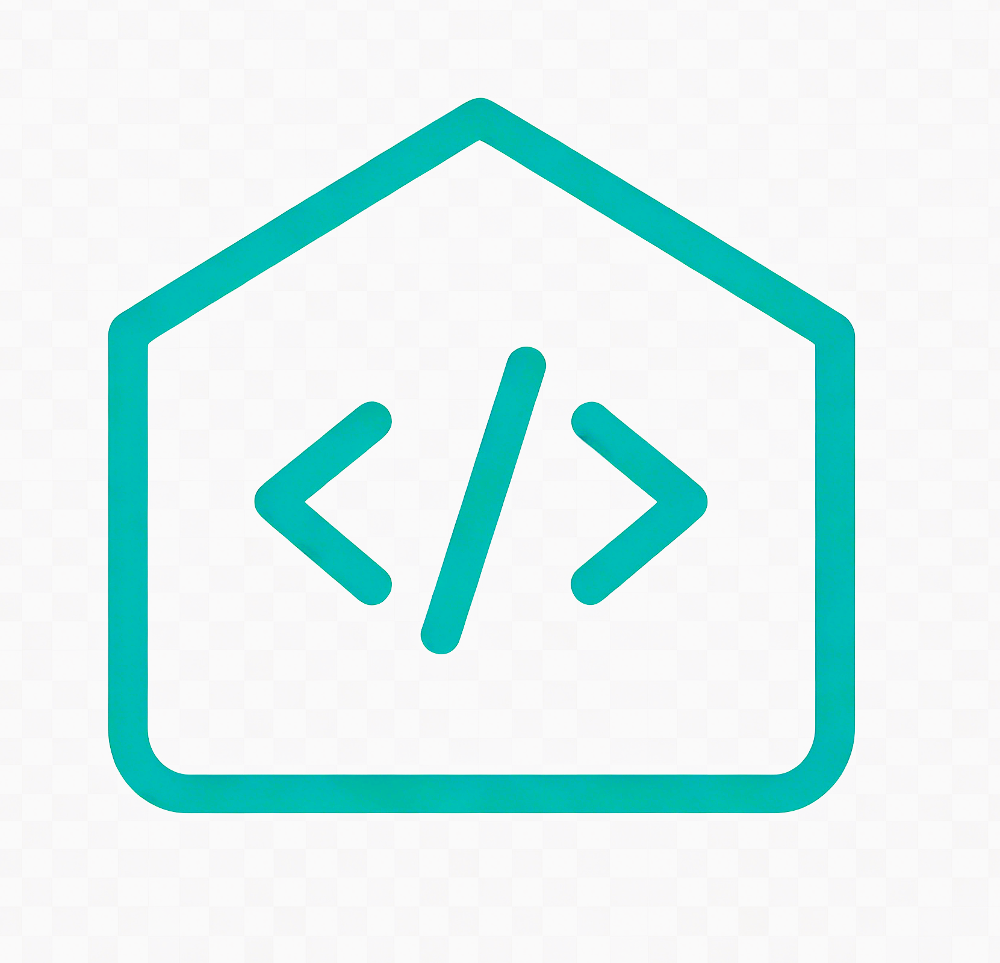
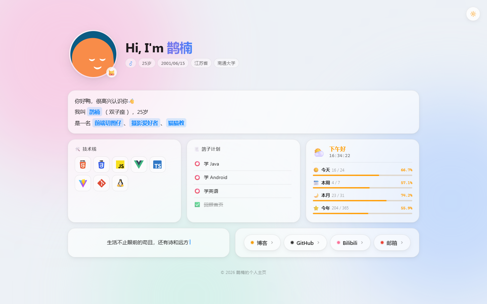
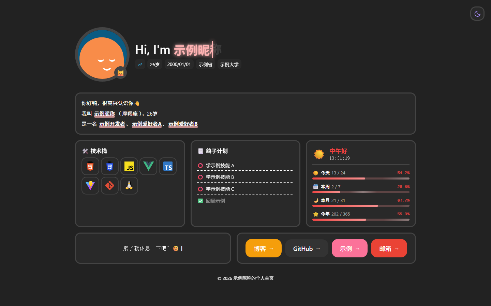
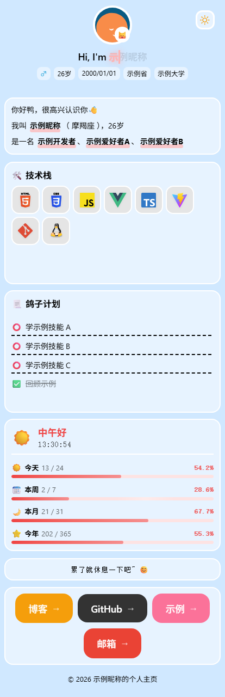
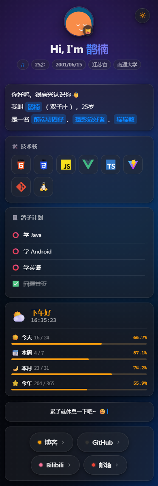
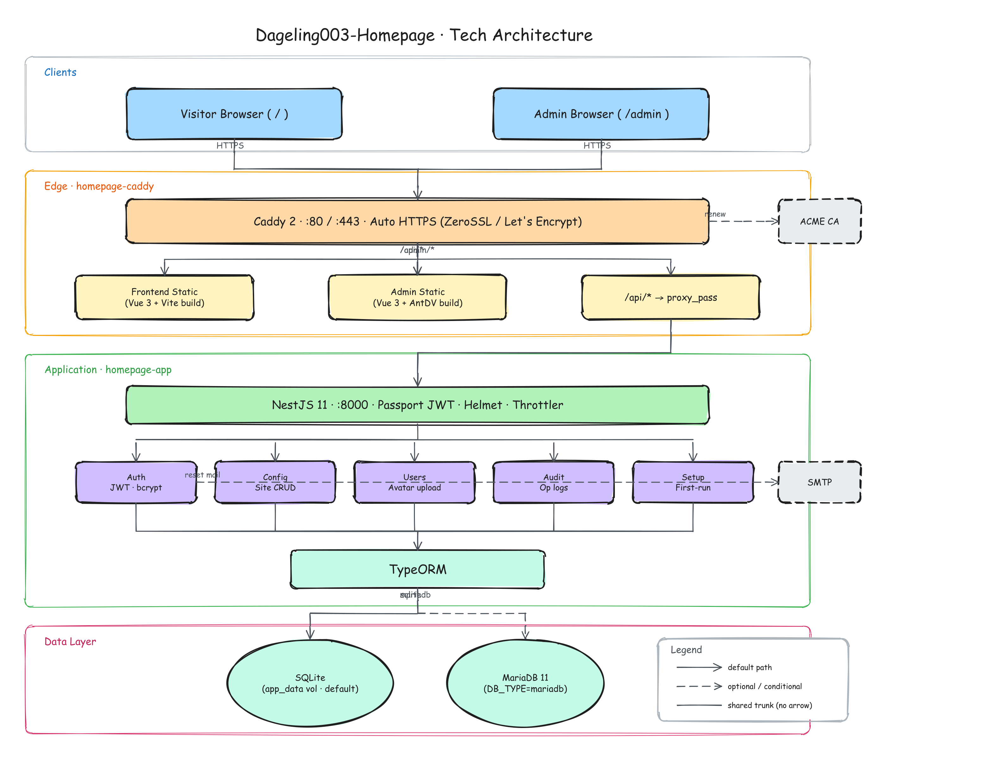

<p align="center">
  
</p>

<h1 align="center">Dageling003-Homepage</h1>

<p align="center">
  站在 <a href="https://github.com/QNquenan/Simple-Homepage">Simple-Homepage</a> 的肩膀上 —— 保留极简个人主页的美学基因，加一个<strong>可视化管理后台</strong>，让「改主页」从改 JSON 变成点几下鼠标。
</p>

<p align="center">
  <strong>简体中文</strong> · <a href="./README.en.md">English</a>
</p>

<p align="center">
  <a href="https://github.com/Dageling003/Dageling003-Homepage/releases"></a>
  <a href="https://dageling003.top/"></a>
  <a href="https://nodejs.org"></a>
  <a href="https://pnpm.io"></a>
  <a href="https://nestjs.com"></a>
  <a href="https://vuejs.org"></a>
  <a href="./docker-compose.yml"></a>
  <a href="./LICENSE"></a>
</p>

- **在线预览**：<https://dageling003.top/>（徽章离线时以仓库截图为准）
- **技术栈**：Vue 3 + Vite 前台/后台 · NestJS 11 + TypeORM API · SQLite（默认）/ MariaDB（可选） · Caddy 反代 + 自动 HTTPS
- **交付形态**：pnpm monorepo（前台 / 后台 / API 三包）+ Docker Compose 默认 2 服务（app + caddy）；`DB_TYPE=mariadb` 时按 `--profile mariadb` 追加 mariadb 服务

---

## 💡 缘起：为什么又造一个「个人主页」

一开始只是想给自己搭个主页，翻到 [Simple-Homepage](https://github.com/QNquenan/Simple-Homepage)——审美在线、部署轻，但两个问题挡住了我：

1. **改内容要动 JSON**：换个头像、加个链接、改句签名，都得回到编辑器手撸配置、重新发布
2. **没有「后台」这层**：多人、多端、临时改内容都不顺手，也没法记录谁在什么时候改过什么

于是决定沿着它的思路重做一次：**主页的美学不动，把「配置」变成「产品」**。

| 维度 | Simple-Homepage | Dageling003-Homepage |
|------|-----------------|----------------------|
| 主页形态 | 极简单页 · 静态 | 极简单页 · 动态渲染 |
| 内容管理 | 手改 JSON + 重新部署 | 可视化后台表单，即改即生效 |
| 技术栈 | 纯静态 | Vue 3 + NestJS 全栈（前台 / 后台 / API 三包） |
| 数据存储 | 无（写死配置） | SQLite（默认，单文件）/ MariaDB（可选），审计留痕 |
| 部署 | 静态托管 | Docker Compose 一键 + 自动 HTTPS |
| 安全 | 无鉴权需求 | JWT + bcrypt + helmet + 限流 |

迭代路线也很朴素：**跑通全栈 → 换成自己熟悉的 Vue 3 技术栈 → UI 迭代美化 → 加审计 / 向导 / 忘记密码等生产化能力**。所以你会看到这个仓库里既有极简主页的影子，也有一整套可自托管的后台产品。

> 如果你只想要**一个 5 分钟能挂上线的静态主页**，Simple-Homepage 就够了，去点个 ⭐。<br />
> 如果你想要**长期维护、多人协作、可视化改内容**的主页，欢迎继续往下看。

---

## 📸 效果展示

> 截图中姓名、地区、学校、生日等隐私信息均已替换为示例占位符。

<table>
  <tr>
    <td width="50%" align="center">
      <strong>桌面 · 亮色</strong><br />
      
    </td>
    <td width="50%" align="center">
      <strong>桌面 · 暗色</strong><br />
      
    </td>
  </tr>
  <tr>
    <td align="center">
      <strong>移动端 · 亮色</strong><br />
      
    </td>
    <td align="center">
      <strong>移动端 · 暗色</strong><br />
      
    </td>
  </tr>
</table>

---

## ✨ 功能

- **前台展示**：亮/暗主题、打字机欢迎语、时光进度条、响应式布局（≥1024px 三栏 / <1024px 单栏）
- **可视化后台**：Ant Design Vue 表单驱动，个人信息 / 快捷链接 / 技术栈 / 待办 / 打字机文字全表单化
- **JWT + bcrypt**：默认阈值新手友好（bcrypt=10、JWT≥16、密码≥8），全部可通过环境变量调高
- **头像上传**：MIME + magic bytes 双重校验，统一转 200×200 WebP
- **智能填报**：生日 → 自动计算年龄 / 星座；34 省选择器
- **首次设置向导**：`/admin/setup` 图形化引导创建管理员 + 配置全站内容
- **一键部署**：`bash scripts/deploy.sh` 向导 → `docker compose up -d --build`，自动 HTTPS（ZeroSSL 默认，国内可用）
- **默认极简**：SQLite 单文件持久化（无需 MariaDB 容器）；限流 / 严格 CSP / 审计 / 忘记密码 / PWA / 背景动效等**重量级功能默认关闭**，需要时用户在 `.env` 显式开启

### 可选功能开关（默认全关，需要时开启）

后端 `.env.docker`：

| 变量 | 说明 |
|------|------|
| `AUDIT_ENABLED=true` | 审计日志：登录 / 改密 / 配置变更落库，前后台 UI 显示「操作日志」入口 |
| `PASSWORD_RESET_ENABLED=true` | 忘记密码 + SMTP：需同时配 `SMTP_*` 才能发邮件 |
| `THROTTLE_ENABLED=true` | 全局限流 120/min（登录接口 5/min 硬限一直生效） |
| `SECURITY_HEADERS_STRICT=true` | 严格 CSP + HSTS preload + COEP（默认关：允许 iframe / 跨域） |
| `BCRYPT_ROUNDS=12` `MIN_PASSWORD_LENGTH=12` `MIN_JWT_LENGTH=20` | 安全阈值调高 |
| `DB_TYPE=mariadb` | 用 MariaDB 替代默认 SQLite（同时 `docker compose --profile mariadb up`） |

前端（`apps/admin/.env`）：`VITE_AUDIT_ENABLED` / `VITE_PASSWORD_RESET_ENABLED`

前台（`apps/frontend/.env`）：`VITE_PWA_ENABLED` / `VITE_AMBIENT_ENABLED`（磨砂玻璃背景 orbs + grain）

---

## 🏗 架构

<p align="center">
  
</p>

> 图源：[`image/architecture.excalidraw`](./image/architecture.excalidraw) —— 可拖入 <https://excalidraw.com> 直接编辑。渲染脚本使用 [roughjs](https://github.com/rough-stuff/rough) 生成手绘风格 SVG，再由 [sharp](https://github.com/lovell/sharp) 光栅化为 PNG。

| 子项目 | 技术栈 | 开发端口 | 对外路径 |
|--------|--------|----------|----------|
| `apps/frontend` | Vue 3.5 + Vite 8 + UnoCSS + Pinia | `3000` | `/` |
| `apps/admin` | Vue 3.5 + Ant Design Vue 4 + ECharts | `3001` | `/admin/*` |
| `apps/backend` | NestJS 11 + TypeORM (SQLite/MariaDB)，JWT 认证 | `8000` | `/api/*` |

> 前后台的 HTML/JS/CSS 由 Caddy 直接 serve，不经过 Node 进程，仅 API 打到后端。图中虚线为可选/条件路径：`DB_TYPE=mariadb` 时才走 MariaDB，`PASSWORD_RESET_ENABLED=true` 时才走 SMTP，Caddy → ACME CA 为证书自动续签。

---

## 🚀 快速开始

### 一条命令上线（生产 / 全新服务器）

脚本会：**自动安装 Docker**（如未安装）→ **克隆代码** → **构建镜像** → **拉起容器** → **冒烟测试** → **打印访问地址**。

**海外服务器（全自动，推荐）：**
```bash
curl -fsSL https://raw.githubusercontent.com/Dageling003/Dageling003-Homepage/main/scripts/install.sh \
  | CI=true DOMAIN=your-domain.com ACME_EMAIL=you@example.com bash
```

**国内服务器（全自动，推荐）：**
```bash
curl -fsSL https://raw.githubusercontent.com/Dageling003/Dageling003-Homepage/main/scripts/install.sh \
  | CI=true CN=true DOMAIN=your-domain.com ACME_EMAIL=you@example.com bash
```

> 把 `your-domain.com` 换成你实际的域名（如 `blog.example.com`）或服务器公网 IP（如 `1.2.3.4`）。
> 把 `you@example.com` 换成你**真实能收到邮件的邮箱**。

#### 三个参数分别是什么？（新手先读一下）

| 参数 | 是什么 | 不填会怎样 |
|------|--------|-----------|
| `DOMAIN` | 网站访问入口 —— 你的域名或服务器公网 IP。域名要**提前把 DNS A 记录解析到本机**；IP 部署跳过 HTTPS 走纯 HTTP | 默认 `localhost`，只能本机访问 |
| `ACME_EMAIL` | HTTPS **证书通知邮箱**。Caddy 用它去 Let's Encrypt / ZeroSSL 注册 ACME 账号；**证书到期前 20 天** CA 会用这个邮箱提醒你续签（Caddy 会自动续，这只是保险） | 走 Let's Encrypt 匿名账号 —— 证书**照样能签发**，只是 CA 无法主动提醒你到期。**IP 部署可完全省略**（IP 不需要证书） |
| `CI=true` | 全自动模式，不做交互问答 | 走交互向导（进服务器一步步问） |
| `CN=true` | 国内模式：用 `docker.1ms.run` 加速拉镜像，避开 `gcr.io` 网络问题 | 直连官方镜像源，海外/带梯子的机器合适 |

> **为什么强烈建议填 `ACME_EMAIL`**：ZeroSSL 从 2024 起强制要求 email，脚本会自动 fallback 到 Let's Encrypt 匿名账号。填了邮箱能让证书体验更完整（有到期提醒 + 用 ZeroSSL 国内节点更快）。填错格式脚本会拒绝启动，防止空跑一遍才发现。

#### 只想快速试一试？（连域名都还没）

```bash
# 用服务器公网 IP 部署，纯 HTTP，无需 ACME_EMAIL
curl -fsSL https://raw.githubusercontent.com/Dageling003/Dageling003-Homepage/main/scripts/install.sh \
  | CI=true DOMAIN=1.2.3.4 bash
```

#### 想走交互向导（脚本一步步问你要参数）：

```bash
# 海外（交互向导）
curl -fsSL https://raw.githubusercontent.com/Dageling003/Dageling003-Homepage/main/scripts/install.sh | bash

# 国内（交互向导）
curl -fsSL https://raw.githubusercontent.com/Dageling003/Dageling003-Homepage/main/scripts/install.sh | CN=true bash
```

向导会依次问你：**域名 → 证书邮箱 → SMTP（可选，找回密码用）→ 管理员密码**。不想填的直接回车跳过，都有合理默认。

已经 `git clone` 过的老手：

```bash
# 海外
make up                    # = bash scripts/deploy.sh
make logs                  # 看日志
make down                  # 停止
make backup                # 备份数据库
make update                # 拉取最新代码 + 重建镜像 + 重启（保留数据）

# 国内（使用 --cn 参数）
bash scripts/deploy.sh --cn
```

### 前置

- 服务器：任何能跑 Docker 的 Linux（内存 ≥ 512 MB，默认走 SQLite 无 MariaDB）
- 端口：80 / 443 未被占用
- 本地开发额外需要：Node.js ≥ 22.13 · pnpm ≥ 11

### 本地开发（SQLite，无需数据库）

```bash
git clone https://github.com/Dageling003/Dageling003-Homepage.git
cd Dageling003-Homepage
pnpm install
cp apps/backend/.env.example apps/backend/.env
# 编辑 .env：DB_TYPE=sqlite（默认），设置 JWT_SECRET（≥16 位）和 DEFAULT_ADMIN_PASSWORD（≥8 位）
pnpm dev
```

三端并行启动后：

| 服务 | 地址 |
|------|------|
| 前台主页 | http://localhost:3000 |
| 管理后台 | http://localhost:3001 |
| Swagger | http://localhost:8000/api/docs |

需要三窗口独立日志时改用 `pnpm dev:backend` / `pnpm dev:frontend` / `pnpm dev:admin`。

> 想本地跑 MariaDB？属于高级路径（99% 的个人主页用不到）。步骤见 [docs/deployment.md → 本地开发部署](./docs/deployment.md#本地开发部署)。

---

## 🐳 Docker 部署

**零基础一步一步走** → [docs/deploy-beginner.md](./docs/deploy-beginner.md)
**完整参考** → [docs/deployment.md](./docs/deployment.md)

### 三种入口，任选其一

```bash
# ① 远程一键 — 海外全自动（推荐，裸机可用）
curl -fsSL https://raw.githubusercontent.com/Dageling003/Dageling003-Homepage/main/scripts/install.sh \
  | CI=true DOMAIN=your-domain.com ACME_EMAIL=you@example.com bash

# ① 远程一键 — 国内全自动（自动处理 Docker 安装 + 镜像加速 + gcr.io 兼容）
curl -fsSL https://raw.githubusercontent.com/Dageling003/Dageling003-Homepage/main/scripts/install.sh \
  | CI=true CN=true DOMAIN=your-domain.com ACME_EMAIL=you@example.com bash

# ② 已 clone 的老手
make up                                                              # 海外
CI=true CN=true bash scripts/deploy.sh                              # 国内

# ③ 传统脚本
bash scripts/deploy.sh                                              # 交互向导
CI=true DOMAIN=xxx ACME_EMAIL=you@example.com bash scripts/deploy.sh # 零交互（CI/CD）
```

> 把 `你的域名或IP` 换成实际值，如 `example.com` 或 `1.2.3.4`。

> 🇨🇳 **国内用户注意**：加 `CN=true` 或 `--cn` 后，脚本会自动完成以下操作：
> - 安装 Docker 时配置国内镜像加速器（docker.1ms.run）
> - 使用 `node:22-slim` 替代 `gcr.io/distroless`（避免国内拉取失败）
> - 自动设置 healthcheck node 路径为 `/usr/local/bin/node`（slim 镜像的 node 路径不同）

### 手动部署（不走向导，自己填 .env）

```bash
cp docker/.env.example .env.docker
# 编辑 .env.docker（DOMAIN / JWT_SECRET / DB_* 密码必填）

docker compose --env-file .env.docker build app     # 先 app
docker compose --env-file .env.docker build caddy   # 后 caddy（依赖 app 镜像里的静态文件）
docker compose --env-file .env.docker up -d
```

### 镜像

| 镜像 | Dockerfile | 大小 |
|------|-----------|------|
| `homepage-app` | `docker/Dockerfile.app`（distroless + 仅生产依赖） | ~120MB |
| `homepage-caddy` | `docker/Dockerfile.caddy`（Caddy 2 + 内置前端/后台静态） | ~50MB |

未发布到 Docker Hub，需自行构建。

### HTTPS 证书

Caddy 内置自动续签。默认 ZeroSSL（国内可用），可切 Let's Encrypt：

```dotenv
# .env.docker
ACME_CA=https://acme-v02.api.letsencrypt.org/directory
```

---

## 🛠 常用命令

```bash
# Makefile（推荐）
make help        # 列出所有命令
make up          # 部署 / 启动
make down        # 停止
make logs        # 实时日志
make backup      # 备份数据库
make dev         # 本地 pnpm 三端并行

# 原生 pnpm
pnpm dev / dev:backend / dev:frontend / dev:admin
pnpm build
pnpm lint
pnpm format

# 原生 docker compose
docker compose --env-file .env.docker ps
docker compose --env-file .env.docker logs -f app
docker compose --env-file .env.docker restart app
docker compose --env-file .env.docker down

# 独立脚本（保留 6 个核心脚本）
bash scripts/install.sh          # 远程一键
bash scripts/install-docker.sh   # 只装 Docker
bash scripts/deploy.sh           # 部署向导
bash scripts/update.sh           # 更新
bash scripts/backup-db.sh        # 备份
bash scripts/smoke-test.sh       # 冒烟测试
```

---

## 📂 目录结构

```
├── apps/
│   ├── frontend/            # Vue 3 + UnoCSS
│   ├── admin/               # Vue 3 + Ant Design Vue + ECharts
│   └── backend/             # NestJS (auth / config / audit / users)
├── docker/
│   ├── Dockerfile.app       # 后端 API 镜像
│   ├── Dockerfile.caddy     # Caddy + 前后端静态镜像
│   └── .env.example
├── caddy/
│   ├── Caddyfile            # 生产（构建进镜像）
│   ├── Caddyfile.dev        # 开发/内网反代
│   └── entrypoint.sh
├── scripts/                 # deploy / build / update / backup-db / smoke-test / ...
├── docs/                    # 部署 / 架构 / API / 开发 / 技术选型 / 变更日志
├── docker-compose.yml
└── pnpm-workspace.yaml
```

---

## 🔒 安全

**默认阈值对个人主页友好**，可通过环境变量随时调高：

- `JWT_SECRET` 启动强校验（默认 ≥16 位、非默认占位，可用 `MIN_JWT_LENGTH` 调整）
- 密码 bcrypt 默认 10 rounds（可用 `BCRYPT_ROUNDS` 调整）；密码默认 ≥8 位（`MIN_PASSWORD_LENGTH`）
- helmet：默认关闭严格 CSP / COEP / HSTS preload；想要更严设 `SECURITY_HEADERS_STRICT=true`
- 限流：登录 5 req/min 硬限；全局 120 req/min 需 `THROTTLE_ENABLED=true`
- 请求体 1MB 上限
- 头像上传：MIME + magic bytes 双校验，统一 200×200 WebP，≤5MB
- 生产环境禁用 Swagger
- `.env` / `.env.docker` 未纳入版本控制

---

## 🔧 故障排查

| 现象 | 常见原因 | 解决 |
|------|----------|------|
| `homepage-app is unhealthy` → 依赖启动失败 | JWT_SECRET 未配 / 数据库密码不匹配 / 老版本 CMD 路径 bug | `docker logs homepage-app --tail 100`；对照 [deploy-beginner.md](./docs/deploy-beginner.md) 第 10 章 |
| Caddy 起不来 | 80/443 被占用 | `ss -tlnp \| grep -E ':(80\|443)\b'` |
| MariaDB 镜像拉不到 | 国内 Docker Hub 受限 | 配 registry mirror 或改 `MARIADB_IMAGE=` 到清华 / 中科大源 |
| 构建 OOM (exit 137) | 内存 < 2GB | 加 swap 或升配 |
| HTTPS 证书申请失败 | DNS 未生效 / 80 端口不通 / ACME 邮箱空 | 检查 A 记录 + 云安全组，或切 Let's Encrypt |
| 静态文件 404 | Caddy 镜像未包含前端 | 必须**先** build app **再** build caddy |

推倒重来：

```bash
# 保留数据
bash scripts/update.sh

# 连数据一起清
docker compose --env-file .env.docker down -v
rm -f .env.docker
bash scripts/deploy.sh
```

---

## 💾 数据备份

`scripts/backup-db.sh` 会按 `.env.docker` 中的 `DB_TYPE` 自动选备份方式：

- `DB_TYPE=sqlite`（默认）→ `docker cp` 拷出 `.sqlite` 文件后 gzip
- `DB_TYPE=mariadb` → `docker exec ... mariadb-dump | gzip`

```bash
bash scripts/backup-db.sh                # → ./backups/
bash scripts/backup-db.sh /tmp           # 指定目录

# Cron：每天 02:00
0 2 * * * cd /path/to/homepage && bash scripts/backup-db.sh >> /var/log/homepage-backup.log 2>&1

# 恢复（SQLite）
gunzip -c ./backups/homepage_YYYYMMDD_HHMMSS.sqlite.gz > /tmp/homepage.sqlite
docker cp /tmp/homepage.sqlite homepage-app:/app/data/homepage.sqlite
docker compose --env-file .env.docker restart app

# 恢复（MariaDB）
gunzip -c ./backups/homepage_YYYYMMDD_HHMMSS.sql.gz | \
  docker exec -i homepage-db mariadb -u homepage -p'***' homepage
```

---

## 🗺 路由

| URL | 说明 | 需要登录 |
|-----|------|----------|
| `/` | 访客主页 | ❌ |
| `/admin/setup` | 首次初始化向导 | ❌ |
| `/admin/` | 后台登录页 | ❌ |
| `/admin/dashboard` | 仪表盘 | ✅ |
| `/admin/config` | 站点配置 | ✅ |
| `/admin/audit` | 操作日志（需 `AUDIT_ENABLED=true`） | ✅ |
| `/admin/account` | 账号设置 | ✅ |
| `/api/*` | RESTful API | 部分 |
| `/health` | 健康检查 | ❌ |

---

## 📖 文档

完整索引见 [`docs/README.md`](./docs/README.md)。

| 文档 | 说明 |
|------|------|
| [CHANGELOG.md](./CHANGELOG.md) | 版本变更（Keep a Changelog 规范） |
| [SECURITY.md](./SECURITY.md) | 安全策略：漏洞上报渠道 / SLA / 现有安全基线 |
| [ROADMAP.md](./ROADMAP.md) | 产品路线图：短 / 中 / 长期计划 + 不做清单 |
| [deploy-beginner.md](./docs/deploy-beginner.md) | 零基础 30 分钟上线（含避坑手册） |
| [deployment.md](./docs/deployment.md) | 部署完整参考 |
| [architecture.md](./docs/architecture.md) | 架构设计 |
| [api.md](./docs/api.md) | API 清单 |
| [dev-guide.md](./docs/dev-guide.md) | 开发指南 |
| [technology-selection.md](./docs/technology-selection.md) | 技术选型 |
| [progress.md](./docs/progress.md) | 版本节点与演进 |

每份文档均有 `.md` / `.en.md` 双语版本，`docs/log/` 保存本地联调测试报告。

---

## 🔍 SEO

CSR SPA，`index.html` 内置 `<meta description/keywords>`、Open Graph、Twitter Cards、JSON-LD Person schema。爬虫无法读取 Vue 动态渲染内容 —— 需要 SSR 请自行接入 Nuxt / Prerender。

---

## 🤝 贡献

流程与约定见 [`CONTRIBUTING.md`](./CONTRIBUTING.md)（含 Skill 体系与 AI Agent 说明）。

1. Fork → 创建 `feat/xxx` 分支
2. 提交遵循 [Conventional Commits](https://www.conventionalcommits.org/)
3. `pnpm lint` 通过后开 PR

---

## 📄 许可证

[MIT License](./LICENSE)

---

## 🙏 致谢

- **灵感来源**：[QNquenan/Simple-Homepage](https://github.com/QNquenan/Simple-Homepage) —— 本项目的起点，主页美学与「极简单页」的思路都从这里发芽
- **前端**：Vue 3 · Vite · Pinia · UnoCSS · Ant Design Vue · ECharts · Iconify · VueUse · Axios · Day.js
- **后端**：NestJS · TypeORM · better-sqlite3（默认）/ mariadb 驱动（可选） · Passport · @nestjs/jwt · bcryptjs · class-validator · helmet · @nestjs/throttler · sharp · Multer · Nodemailer · Swagger
- **部署**：Docker · Caddy · ZeroSSL / Let's Encrypt · PM2
- **工程化**：pnpm · TypeScript · ESLint · Prettier · Jest · Supertest · GitHub Actions

如果这个项目对你有帮助，欢迎点一颗 ⭐。
